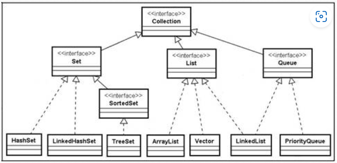

# Collections
  - correspondem a estruturas de dados que permitem armazenar, organizar e manipular grupos de objetos.
  - a API de collections tem interfaces e implementações para atender diversas necessidades.

## Interfaces de Collection
  -  *Collection*: interface raiz que define operações básicas comuns a todas as collections
~~~java
Collection<String> minhaColecao = new ArrayList<>();
minhaColecao.add("Elemento1");
minhaColecao.add("Elemento2");
~~~
  -  *List*: sequência ordenada de elementos com acesso por índice
~~~java
List<Integer> minhaLista = new ArrayList<>();
minhaLista.add(10);
minhaLista.add(20);
~~~
  -  *Set*: collection que não permite elementos duplicados
~~~java
Set<Double> meuConjunto = new HashSet<>();
meuConjunto.add(3.14);
meuConjunto.add(2.71);
~~~
  -  *Queue*: interfacce para collections que representam filas
~~~java
Queue<String> minhaFila = new LinkedList<>();
minhaFila.add("Primeiro");
minhaFila.add("Segundo");
~~~

## Implementação de Collection
  - *ArrayList*: implementação
  - *LinkedList*:
  - *HashSet*:
  - *TreeSet*:
~~~java
ArrayList<String> lista = new ArrayList<>();
lista.add("A");
lista.add("B");
~~~

~~~java
HashSet<Integer> conjunto = new HashSet<>();
conjunto.add(10);
conjunto.add(20);
~~~
